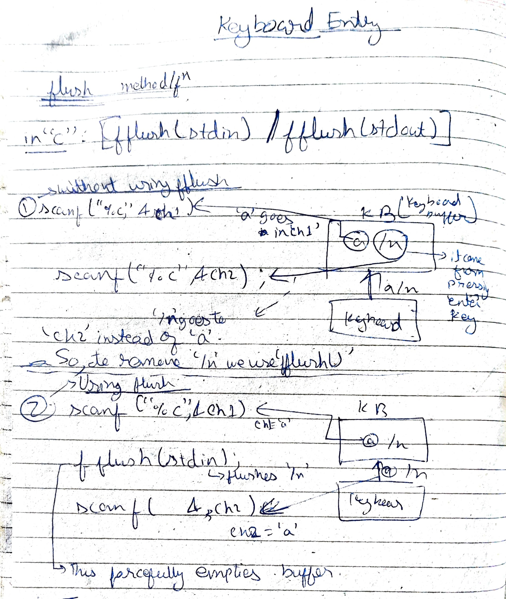
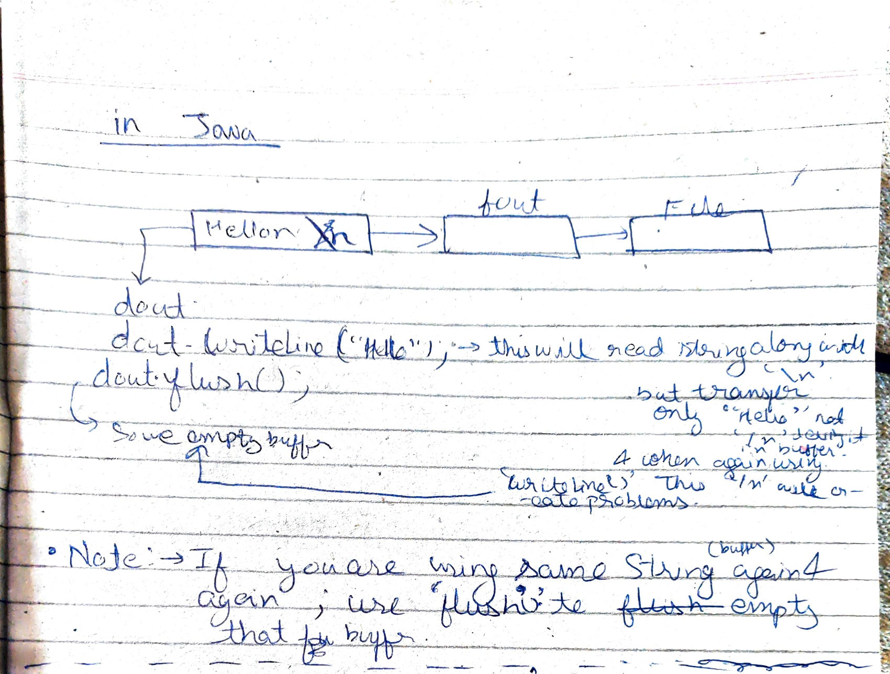

# IO(Input-Output) operations and File Handling in Java

* IO classes is used to connect the Java program to any IO device to perform IO operations.

---

```
C programs <--stdio.h--> IO devices {'C' programs are directly connected}

C++ <---Stream(iostream.h)----->  | In C++ or Java, program is not directly 
                                  | connected through a mediator known as
Java <---Stream---->              | 'Stream'

Note:- Stream is referred as flow of bytes.
```

## Need and uses for Stream

* When directly connect to device, performance is degraded as data is sent on by one, whereas while using stream we use a buffer to store data and then send in one go.
* While making object of Stream class, we pass ref. of device in constructor to which we have to connect.
* As we make obj of Stream class, a buffer comes into memory.
* We use 'write()' method to put data in this buffer & soon as object(buffer) gets filled all the data flows(made to flow) towards the destination.
* Only Stream class buffer can be flows towards the destination.
* File Handling also uses stream, but we don't generally use File-Handling so much in Java, becoz of presence of JDBC which is much efficient.
* Stream are mostly used for data transfers via Network.
* Streams are also represented via object and for those object There are many Stream Classes. For each device there is a Stream class found in `java.io` and `java.nio` packages.

---

##  Classification of Streams

### There are two types of Stream

(i) Input Stream -> For input devices connectn.
(ii) Output Stream -> For output device connectn.

IP devices(keyboard, file, network) -> Input Stream -> Java Program -> Output Stream -> Output Devices(Monitor, file, network)

* In Java, for taking IP via keyboard or OP via monitor, we don't generally use stream, if we do so we would be making console based software, whereas today GUI/Web based software is used like `System.out.println` gives on console.

## Stream classes

* Java has divided the Stream classes in two parts

```
Stream class
|   |
|   |--ByteStream(only supports ASCII characters)
|                                              |--> InputStream(abstract) -> int read()
|                                              |--> OutputStream(abstract) -> write(int i)
|
|------CharStream(supports Unicode, used in web based)
                                              |--> Reader(abstract) -> int read()
                                              |--> Writer(abstract) -> write(int i)

```

## Low and High Level Streams

Character and Byte Stream classes are further classified into low-level and high-level streams.

### Low Level Streams
Directly connected to any IO device.

Java Program <-> FileIOStream <-> File

### High Level Stream

High level streams are connected to other streams. They are used to increase the performance of other stream. They are also known as 'filtered' stream.

Java Program <--> BufferedIOStream <--> FileIOStream <--> File

```java
FileOPStream fout = new FileOPStream("abc.txt");
BufferedOPStream bout = new BufferedOPStream(fout);

DataOPStream dout = new DataOPStream(fout/bout/*object of input stream*/);
// |-> There is a method of this class `readLine()` which reads line by line. 
```

Java Program <--> DataIOStream <--> BufferedIOStream <--> FileIOStream <--> File

We can connect this `DataInputStream` to keyboard, network to readLine from keyboard etc.


## Keyboard entry

<!-- TODO: Not able to still understand -->
### flush()




### [**FlushDemo.java**](./bytestream/dataIOstream/DataIOStreamFlushAndUTFDemo.java)

Note: If we use `println()` it will write along with new line character hence fully empties the buffer. So, we didn't need to use `flush()` with `println()`. But we have also `flush()` in `PrintStream` class.

## Some important points:-

* While performing any operation on File like counting freq. of characters etc. don't perform directly on file, but instead export file data to a string and perform operatn on this string. And then override the file. This will make things easier.
* If you are using same String(buffer) again & again ; use flush() to empty that buffer.
