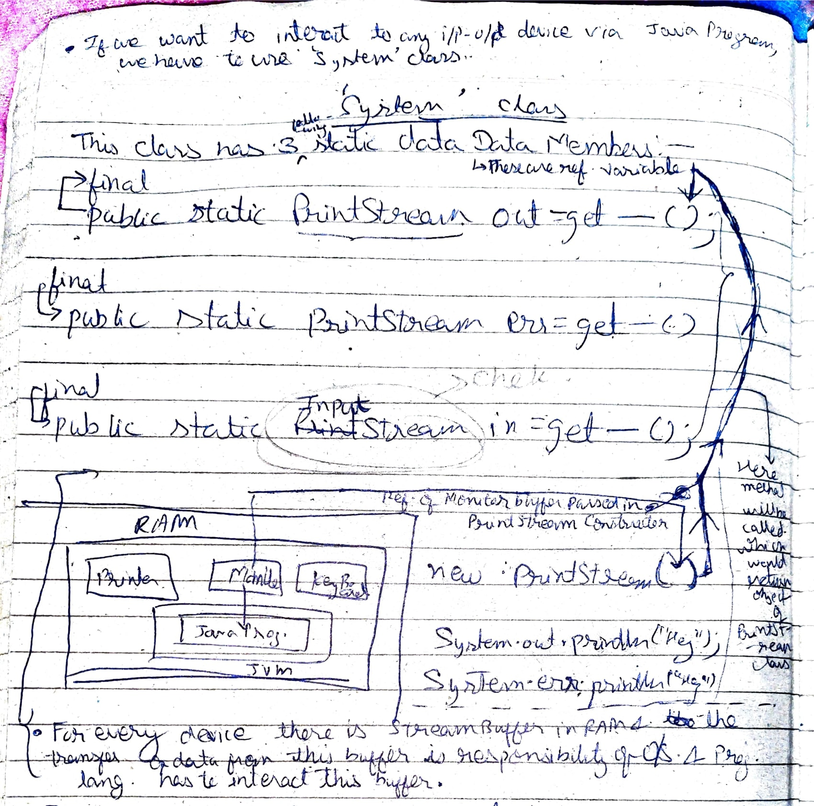

# System Class

**If we want to interact to any IO device via Java Program, we have to use `System` class.**

## System class has 3 static data members:

```java
public static PrintStream out = get___()
public static PrintStream err = get___()
public static PrintStream in  = get___()
```




## Difference b/w `System.out` and `System.err`:-

* For normal messages use `System.out`. For errors and exceptions use `System.err`

* Another diff.
We have same redirection operators in console by means of which we can redirect messages of `System.out.println()`

```java
class Temp {
    psvm() {
        Sysout("hello");
        Sysout("hey")
    }
}
```

```bash
$ > java Temp > abc.txt
$ > java Temp >> abc.txt # appends to file
```

But if we use `System.err` we can't redirect using `>` or `>>`, instead we have to use `2>` or `2>` respectively.

## setOut/setErr (changing value of `System.out/err`)

[PrintStreamRedirect.java](../PrintStreamSetOutErrDemo.java)


## Redirect InputStream or `System.in`

In `System` class:

```java
final public static InputStream in = get() ==> InputStream is topmost and abstract class
int x = System.in.read() => searches for single character in keyboard buffer and returns its ASCII value
```

Now, redirecting

```java
FileIPStream fin = ...("abc.txt")
System.setIn(fin);
int x = System.in.read() // reading from file not keyboard
```

[InputStream Notes](../../inputstream/InputStream_notes.pdf)
