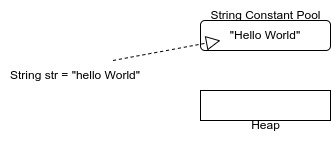
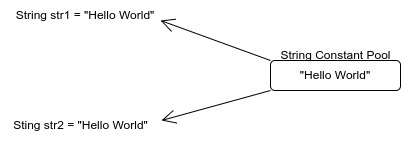
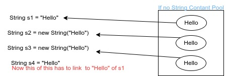

# `String` class

* In Java's `String` class makes use of `private byte` array.
    * **TODO**: How Does String store unicode values which are > Byte.MAX_VALUE?
* This means in Java alo, Strings are represented via hidden Arrays.
* So, whenever we create String object, Java extracts ASCII value of character and puts them in `byte` type array.

---

## Creating objects of `String` class

### Method-1:- using `new` and constructor

```java
String str = new String("Hello World!");
System.out.println(s.length()); //]--> `str.length()` => method of 'String' class to return number of characters in String
```

**Que:** What is difference b/w '.length' and '.length()'?
`.length` => Property of array that gives size of array.
`.length()` => Method of 'String' class to find number of characters.

### Method-2:- Via String Literal

```java
String str = "Hello World!";
System.out.println(str.length());
```

**Que:** How we created object without using'new' in above?
Like every integer literal is treated as 'int' and every floating literal as 'double'.
**Rule:** Similarly, All String literal i.e. everything within double-quotes `".."` are treated as String and belongs to 'String' class.
And writing in `"..."` represents anonymous object of 'String' class.

Example:- Showing string-literal is an anonymous object

```java
class LiteralAnonDemo {
    /*
    Here as we can see `.length()` runs with string-literal proving it to be String anonymous class.
    */
    public static void main(String[] args) {
        int strLen = "Hello World!".length();
                            //   ↳ non-static method of 'String' class.
        System.out.println(strLen);
    }
}
```

#### Multi-line string

```java
String str = """
    Get busy living
    or
    get busy dying.
    --Stephen King""";
```

---

* The object created by String literal are not stored in (object)Heap.
* They store in 'String Constant Pool(SCP)' of MetaSpace(called PermGen till JDK-1.7).



**Rule:**

* Whenever we create object of a 'String' class via String literals, they kept in special memory area called 'String Constant Pool'.
* Because 'String' objects are immutable, they can be shared.



Following will prove both `str1` and `str2` shares same object:
`Sysout(str1 == str2)`

* String Constant Pool(SCP) doesn't contain duplicate object of 'String' class.
* Garbage collection is **not** done on String class object when they are kept in a SCP i.e. when created using String literal.


---

```java
String str = "Hello World!";
System.out.println(str)
```
**O/P:** Hello World!

Here, on printing reference variable, we get actual String as O/P, this means 'String' class has overridden `toString()` method of 'Object' class.

---

**Que:** Why we have method to create object from literal?
If we are using same string again and again, we are making objects again and again. If we use `new` operator, which will take a lot of memory.
To overcome this, we use literals and since 'String' objects are immutable we can create object only once and share its reference each time same literal is used.

#### NOTE:
* So, when we want to allocate new object(memory) each time we use `new`.
* We use literal when we want to share the object.

**Que:** Why do we have method to create object from literal?


---

**Que:** Why we created String Constant Pool?

**If no SCP**:-



When we want to link "Hello" of 's1' to 's4' we will not know which "Hello" is created by 's1' or 's2' or 's3', if SCP is not present.

So, to overcome this confusion, we created SCP, which will give us a new area for objects created via literal. ]-> Java uses it internall for 'Serialization'

**Que:** Why SCP doesn't have duplicate object?
For object to be shared and save memory.

**Que:** Why garbage is not collected in SCP?
// TODO:

---

### Method-3: Making String object via constructors

#### 1. Default Constructor: `String()`
This is useless as it creates a `byte[]` of 0 length.

#### 2. String(StringLiteral)

`String str = new String("Hello");`
This will create 2 objects. One that is passed in SCP. Other one goes in Heap(as it is created using `new`).

* By default the ref. of object in heap is passed in 'str'.
But we can also pass ref. of object of SCP in 'str', using the technique below

```java
String s1 = new String("hello");
String s2 = s1.intern(); // links object of SCP to s2, if not present in SCP it will create duplicate in SCP
String s3 = new String("Hello");
String s4 = s3.intern()

System.out.println(s2 == s4)
```

#### 3. 'char' array

a. String(Char ch[]) ---> char []ch = {'d', 'u', 'c', 'a', 't'}; String s = new String(ch);
b. String(char ch[], int position, int no. of elemets)  ---> String s = new String(ch, 2, 3); O/P= "cat"


#### 4. byte array

a. String(byte b[])  ----> String s = new String({65, 66, 61, 68})
b. String(byte b[], int position, int no. of elements)